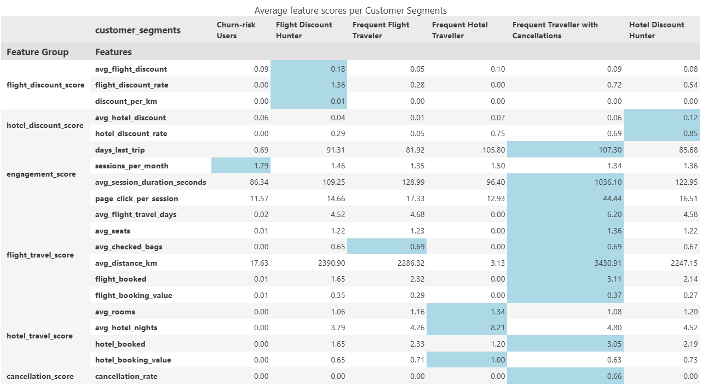

# Customer Segmentation

## Introduction
Customer segmentation plays a crucial role in:  

- Increasing marketing ROI and response rates    
- Enhancing user experience through personalized recommendations  
- Reducing churn by identifying at-risk users  
- Designing products that better meet customer needs  

There are **two main approaches** to segmentation:  

1. **Manual (Rule-based) Segmentation**  
   - Based on simple criteria like age, gender, family status, or spending behavior  
   - *Pros*: Easy to implement and interpret  
   - *Cons*: Static and may miss hidden patterns  

2. **Machine Learning (ML)-based Segmentation**  
   - Leverages statistical models to detect complex patterns automatically  
   - *Pros*: Scalable and potentially more accurate  
   - *Cons*: Requires higher-quality data, may be harder to interpret  

**Hybrid Approach**  
Combining rule-based logic with ML-driven clusters helps improve **interpretability** while leveraging **automation and accuracy**.

## Target Audience & Business Goal
The main goal is to support a **personalized reward campaign** that motivates customers to:  

- Book a **flight**  
- Book a **hotel**  
- Book **both**  

The campaign aims to:  

- Increase **conversion** and **booking rates**  
- Reduce **churn** by targeting **at-risk users**  

Users receive **personalized push notifications** with tailored perks based on:  

- Historical booking behavior  
- Demographic features  

To support this, a **user cohort** was identified in the first step using a **SQL-based data modeling pipeline**.

## Data
- **Source**: TravelTide postgres database  
- **Data Model**: [Data Model](../docs/data_model.md)
- **Features**:  

| Feature Group            | Features                                                                 |  
|--------------------------|---------------------------------------------------------------------------|  
| flight_discount_score    | - avg_flight_discount - flight_discount_rate - discount_per_km     |  
| hotel_discount_score     | - avg_hotel_discount - hotel_discount_rate                            |  
| user_score               | - age - is_married - has_children                                   |  
| engagement_score         | - days_last_trip - sessions_per_month - avg_session_duration_seconds - page_click_per_session |  
| flight_travel_score      | - avg_flight_travel_days - avg_seats - avg_checked_bags - avg_distance_km - flight_booked - flight_booking_value |  
| hotel_travel_score       | - avg_rooms - avg_hotel_nights - hotel_booked - hotel_booking_value |  
| cancellation_score       | - cancellation_rate                                                      |  

## Methods

### 1. **Data cleaning, EDA & Feature Engineering**  
Several preprocessing steps were applied to prepare the data for clustering:  

- **Missing value treatment**: missing values were replaced with `0`.  
- **Skewness correction**: skewed features were log-transformed using `numpy.log1p`.  
- **Feature scaling**: all numerical features were normalized using `StandardScaler` from `sklearn`.  
- **Dimensionality reduction**: `PCA` (Principal Component Analysis) was applied to reduce dimensions and noise.  

### 2. **Model selection**  
Two clustering models were evaluated:  
- **KMeans**  
- **Gaussian Mixture Models (GMM)**  

The optimal number of clusters was selected using the **Elbow Method**, which visualizes the trade-off between cluster count and within-cluster variance (inertia).  
     

### 3. **Evaluation**  
Clusters were evaluated both **quantitatively** and **qualitatively**:  

- Aggregated cluster profiles using the **mean values** of each feature helped interpret the characteristics of each segment.  
- **Validation metrics** used to assess clustering quality:  
  
  | Metric                     | Description                                                                 |  
  |---------------------------|-----------------------------------------------------------------------------|  
  | `adjusted_rand_score`     | Measures similarity between clusterings. Higher = better.                   |  
  | `davies_bouldin_score`    | Measures average similarity between clusters. Lower = better.               |  
  | `calinski_harabasz_score` | Ratio of between-cluster vs. within-cluster dispersion. Higher = better.    |  

These metrics helped ensure that the segments are both distinct and meaningful.   

## Results

## Conclusion  
- Both clustering models performed well on the scaled feature groups. Redundant and highly correlated features must be excluded. This process is **iterative**, and with each new feature group, the models must be **re-evaluated**.  
- The **best results** were achieved by separating features between **flight** and **hotel users**. General travel features were excluded to better differentiate between user types.  
- Based on the resulting segments, the reward program perks can be targeted effectively:  

### Targeted Perks by Segment  

| Segment                          | Reward Perk                          |  
|----------------------------------|---------------------------------------|  
| Frequent Hotel Traveller         | 🏨 Free hotel meal                    |  
| Frequent Flight Traveller        | 🧳 Free checked bags                  |  
| Traveller with Cancellations     | ❌ No cancellation fees               |  
| Flight Discount Hunter           | ✈️ Exclusive flight discounts         |  
| Hotel Discount Hunter            | 🏷️ Exclusive hotel discounts          |  
| Churn-Risk User                  | 🛏️ 1 night free hotel with flight    |   

- other cluster models like DBSCAN or `AgglomerativeClustering` could not be tested due to performance issues (memory usage). The same limitation applied to computing `silhouette_score` on large datasets.

---

## References
- [KMeans-Dokumentation (scikit-learn)](https://scikit-learn.org/stable/modules/clustering.html#k-means)
- [Customer Segmentation with Machine Learning: Targeting the Right Audience](https://medium.com/@byanalytixlabs/customer-segmentation-with-machine-learning-targeting-the-right-audience-656f5d2ce8f8)
- [Segmentation-Notebook](../notebooks/Segmentation.ipynb)  
- [EDA-Notebook](../notebooks/EDA.ipynb)
- [Data Model](../docs/data_model.md)
---

*(updated on: `2025-06-29`)*  
